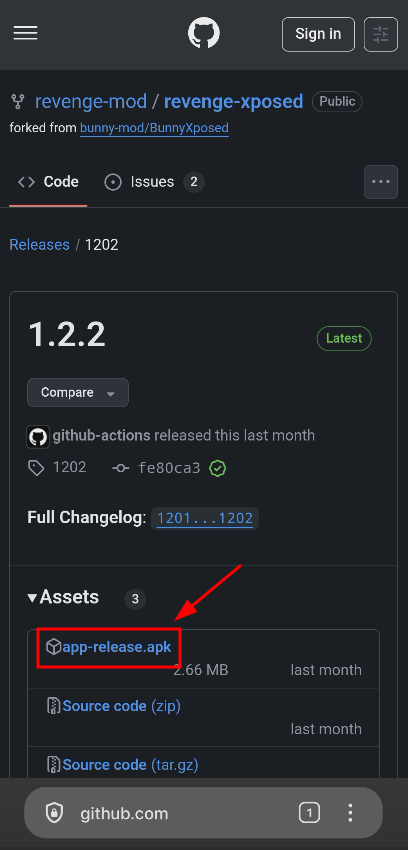
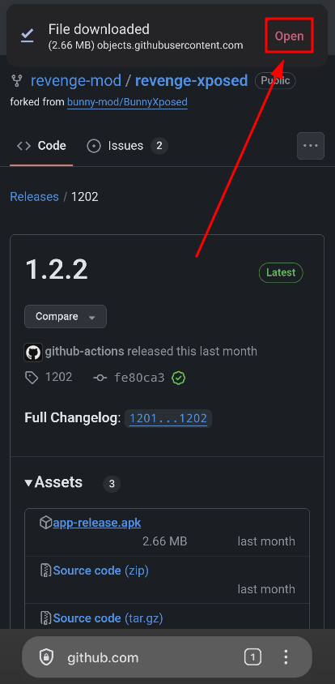
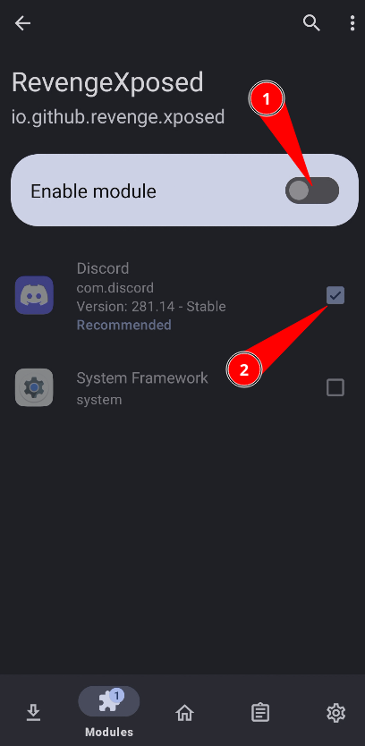

## Installation

> [!NOTE]
> Before continuing, make sure you fulfill the [requirements](0_index.md).

1. Get latest version of revenge-xposed [here](https://github.com/revenge-mod/revenge-xposed/releases/latest). Download the `.apk` file.

	
2. Once downloaded, click on Open.

	
3. Install it.

	
4. Once installed, go to LSposed clicking on the notification

	
5. Now, enable the module and make sure that Discord is selected

	
6. Now, open Discord and go to settings. You should see a `Revenge` section like this:

	
	
That's it! Enjoy!