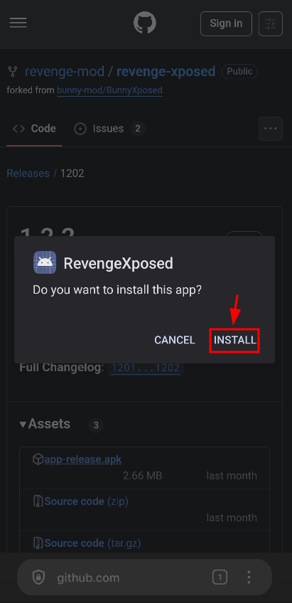
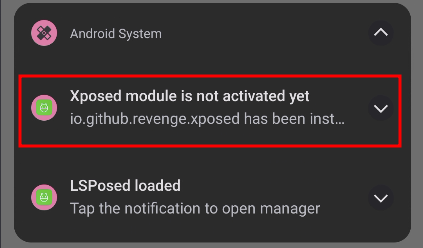
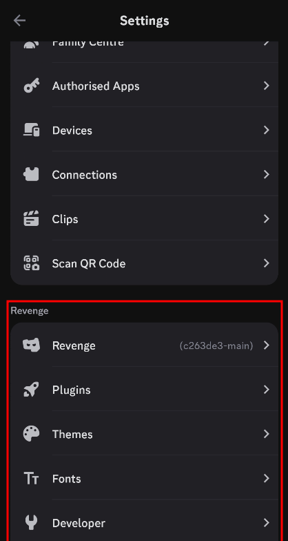

## Instalación 

> [!NOTE]
> Antes de continuar asegúrate de cumplir los [requisitos](0-1_prerequisites).

1. Descarga la última versión de revenge-xposed [aquí](https://github.com/revenge-mod/revenge-xposed/releases/latest). Descarga el archivo `.apk`.

	
2. Una vez descargado, haz click en Abrir.

	
3. Instálalo.

	
4. Cuando esté instalado, abre LSPosed tocando la notificación.

	
5. Activa el módulo y asegúrate de que Discord esté seleccionado.

	
6. Ahora, abre Discord y ve a ajustes. Deberías ver una sección de `Revenge` como esta:

	
	
¡Y ya está!